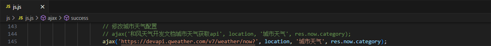

## 天气
由默开发，可获取当前定位天气、可搜索查询当地天气。
### 项目目录
天气
 
├── css
 
│&emsp;&nbsp;&nbsp;└── style.css
 
├── font
 
│&emsp;&nbsp;&nbsp;├── iconfont.ttf
 
│&emsp;&nbsp;&nbsp;├── iconfont.woff
 
│&emsp;&nbsp;&nbsp;└── iconfont.woff2
 
├── image
 
│&emsp;&nbsp;&nbsp;├── 各种天气图标，此处省略.png
 
│&emsp;&nbsp;&nbsp;└── default.png
 
├── js
 
│&emsp;&nbsp;&nbsp;├── jquery-2.1.3.min.js
 
│&emsp;&nbsp;&nbsp;└── js.js
 
├── index.html
### 基于以下技术
HTML5：用于页面布局
 
CSS3：用于页面美化
 
JavaScript：用于页面事件
 
jQuery：用于数据请求
 
百度定位api：用于获取当前定位
 
和风天气api：用于获取定位天气

## 预览
### 天气最小模式

### 自动获取当前定位天气

### 搜索查询当地天气

## 修改配置
### 百度定位api申请：https://lbs.baidu.com
### 百度定位开发文档：https://lbs.baidu.com/index.php?title=jspopularGL
### 和风天气api申请：https://dev.qweather.com
### 和风天气开发文档：https://dev.qweather.com/docs
### JavaScript
### 和风天气授权的key

### 城市信息

### 空气质量

### 城市天气

### 分钟预报

### 空气质量3天

### 城市天气3天
